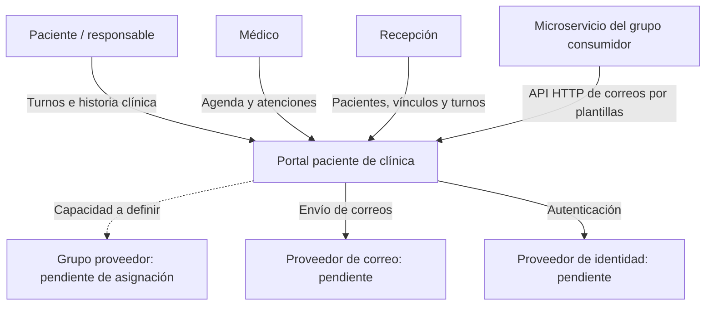
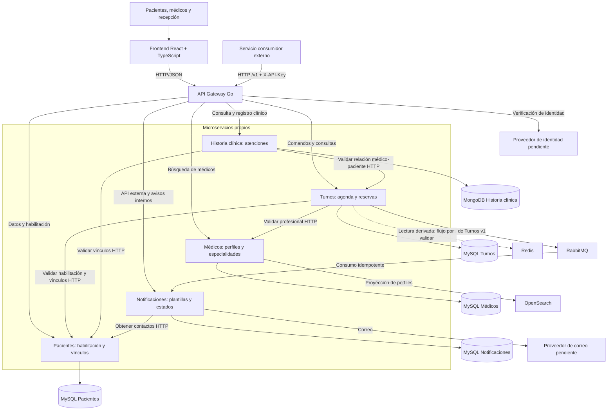

# Diagramas actualizados
contexto.mmd y contenedores.mmd contienen Mermaid procesable. Representan el diseño, no componentes operativos.
Incluyen frontend, propósito y transporte de las conexiones, propiedad de la agenda en Turnos y conexión explícita de Notificaciones a su base.
La capacidad externa a consumir permanece pendiente de asignación; no se inventa un proveedor.
Los archivos diagrams.net originales de Drive no fueron editados. Para conservar ese formato, trasladar estos cambios a los originales antes de presentar. Mermaid puede previsualizarse en GitHub.

## Contexto

## Contenedores

